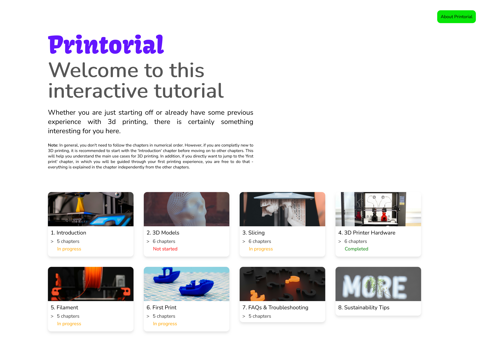

# Printorial  

Printorial is a free and open, web-based tutorial designed to teach **absolute beginners** the fundamentals of 3D printing.  
Created as part of the *Free & Open Technologies* class, this project aims to make 3D printing accessible to everyone through clear explanations, interactive quizzes, and simulations.  

  

**Creator:** Renate Zhang, Alin Düzgün, Anusheh Nejat, Diana Kovacs-Barlutiu, Khrystyna Borodkina

## Project Overview  

The tutorial introduces the **main use cases and workflows of 3D printing** through structured chapters.  
It is designed as an open educational resource so that anyone can learn how to use a 3D printer step by step.  

> **Note:** You don’t need to follow the chapters in order.  
> - If you are completely new to 3D printing, it’s recommended to start with the *Introduction* chapter to understand the basics.  
> - You can also skip ahead directly to the *First Print* chapter to be guided through your first printing experience — it works independently from the other chapters.  

## Features  

- **Educational Focus**: Aimed at beginners with no prior experience  
- **Chapters**: Introduction, 3D Models, Slicing, Hardware, Filament, First Print, FAQ & Troubleshooting  
- **Interactive Quizzes**: Each chapter includes a short quiz to reinforce learning  
- **AR Simulation**: Link to an AR-based simulation for visualizing 3D printing concepts  
- **Open Access**: Entire tutorial is freely available online via GitHub Pages  

## How It Works  

1. Visit the live tutorial: [Printorial Website](https://alinnlaraa.github.io/Printorial/)  
2. Choose any chapter to begin learning.  
3. At the end of each chapter, test your knowledge with a short quiz.  
4. Use the AR simulation link for an additional interactive experience.  

## Technologies  

- Static website  
- HTML, CSS, JavaScript  
- No external libraries  
- Hosted with GitHub Pages  

## Status  

- ✅ Completed project  
- Fully functional tutorial with all chapters, quizzes, and simulation links  
